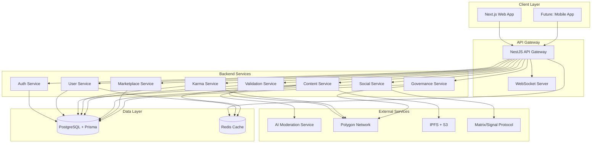
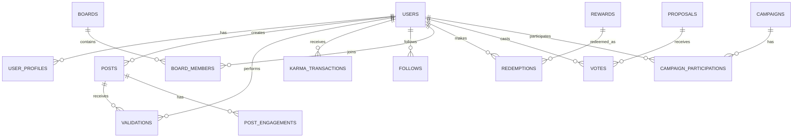
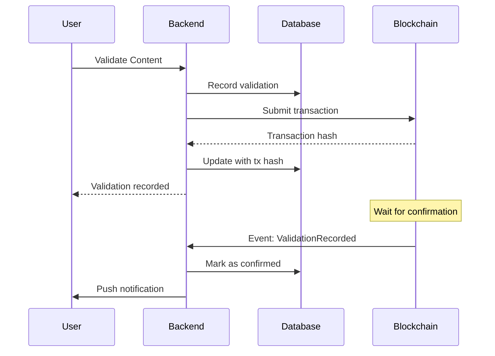
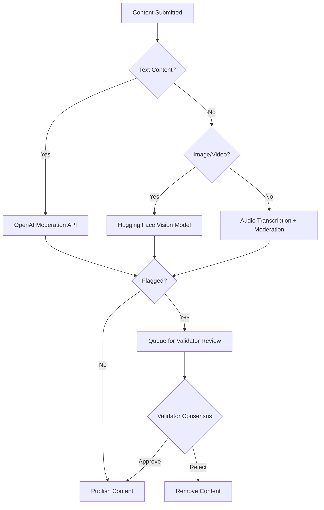

# Design Document

## Overview

Astra is a decentralized social media platform built on a modern tech stack combining Next.js frontend, NestJS backend, PostgreSQL database, Polygon blockchain, and AI-powered moderation. The architecture follows a microservices-inspired approach with clear separation between the presentation layer, business logic, blockchain integration, and AI services.

The platform implements a gamified reputation system (Karma) that drives user progression through mythologically-inspired Leagues, unlocking feature modules (Astras) as users demonstrate authenticity and positive contributions. All critical transactions—validations, Karma changes, and governance actions—are recorded immutably on Polygon blockchain.

### Key Design Principles

1. **Decentralization First**: Critical data (validations, Karma transactions) stored on blockchain; content on IPFS
2. **Privacy by Default**: End-to-end encryption for communications using Matrix/Signal Protocol
3. **Scalability**: Stateless backend services, horizontal scaling capability, efficient caching
4. **Security**: Zero-trust architecture, input validation, rate limiting, secure key management
5. **User Experience**: Progressive enhancement, responsive design, real-time updates via WebSockets

## Architecture

### High-Level System Architecture



### Technology Stack Breakdown


| Layer | Technology | Justification |
|-------|-----------|---------------|
| **Frontend** | Next.js 14+ (App Router) | SSR/SSG for SEO, React Server Components, built-in API routes |
| | Tailwind CSS | Rapid UI development, consistent design system, small bundle size |
| | Zustand | Lightweight state management, simpler than Redux for initial MVP |
| **Backend** | NestJS + TypeScript | Modular architecture, built-in DI, excellent for microservices |
| | Express (under NestJS) | Mature, performant HTTP server |
| **Database** | PostgreSQL 15+ | ACID compliance, JSON support, full-text search, proven scalability |
| | Prisma ORM | Type-safe queries, migrations, excellent DX |
| **Blockchain** | Polygon (Mumbai Testnet) | Low gas fees, Ethereum compatibility, fast finality (~2s) |
| | ethers.js v6 | Industry standard for Ethereum interactions |
| **AI/ML** | Hugging Face Inference API | Pre-trained models for content moderation, cost-effective |
| | OpenAI Moderation API | Backup for content safety checks |
| **Storage** | IPFS (via Pinata/Web3.Storage) | Decentralized content storage, content addressing |
| | AWS S3 | Backup storage, CDN integration via CloudFront |
| **Messaging** | Matrix Protocol | Decentralized, E2E encryption, federation support |
| **Caching** | Redis 7+ | Session storage, rate limiting, real-time leaderboards |
| **DevOps** | Docker + Docker Compose | Consistent dev/prod environments |
| | GitHub Actions | CI/CD automation, testing, deployment |
| | Render/Fly.io | Initial hosting (cost-effective, easy scaling) |
| **Monitoring** | Grafana + Loki | Log aggregation, metrics visualization |
| | Sentry | Error tracking and performance monitoring |

## Components and Interfaces

### 1. Authentication Service

**Responsibilities:**
- User registration and login
- JWT token generation and validation
- Wallet connection (MetaMask, WalletConnect)
- Session management

**Key Interfaces:**


```typescript
interface AuthService {
  register(dto: RegisterDto): Promise<AuthResponse>;
  login(dto: LoginDto): Promise<AuthResponse>;
  connectWallet(dto: WalletConnectDto): Promise<AuthResponse>;
  refreshToken(refreshToken: string): Promise<TokenPair>;
  logout(userId: string): Promise<void>;
}

interface RegisterDto {
  email: string;
  username: string;
  password: string;
  walletAddress?: string;
}

interface AuthResponse {
  user: UserProfile;
  tokens: TokenPair;
}

interface TokenPair {
  accessToken: string;
  refreshToken: string;
}
```

**Database Schema:**
```sql
CREATE TABLE users (
  id UUID PRIMARY KEY DEFAULT gen_random_uuid(),
  email VARCHAR(255) UNIQUE NOT NULL,
  username VARCHAR(50) UNIQUE NOT NULL,
  password_hash VARCHAR(255) NOT NULL,
  wallet_address VARCHAR(42) UNIQUE,
  created_at TIMESTAMP DEFAULT NOW(),
  updated_at TIMESTAMP DEFAULT NOW()
);

CREATE INDEX idx_users_email ON users(email);
CREATE INDEX idx_users_wallet ON users(wallet_address);
```

### 2. User Service

**Responsibilities:**
- User profile management
- Karma balance tracking
- League status management
- Astra unlocks
- User statistics and achievements

**Key Interfaces:**


```typescript
interface UserService {
  getProfile(userId: string): Promise<UserProfile>;
  updateProfile(userId: string, dto: UpdateProfileDto): Promise<UserProfile>;
  getKarmaBalance(userId: string): Promise<number>;
  getLeagueStatus(userId: string): Promise<LeagueInfo>;
  getUnlockedAstras(userId: string): Promise<Astra[]>;
  getUserStats(userId: string): Promise<UserStats>;
}

interface UserProfile {
  id: string;
  username: string;
  email: string;
  walletAddress?: string;
  karma: number;
  league: LeagueType;
  role: UserRole;
  avatarUrl?: string;
  bio?: string;
  createdAt: Date;
}

enum LeagueType {
  CHANDRIKA = 'CHANDRIKA',
  VAJRA = 'VAJRA',
  AGNEYASTRA = 'AGNEYASTRA',
  VARUNASTRA = 'VARUNASTRA',
  PASHUPATASTRA = 'PASHUPATASTRA',
  BRAHMASTRA = 'BRAHMASTRA'
}

enum UserRole {
  CITIZEN = 'CITIZEN',
  VALIDATOR = 'VALIDATOR',
  CREATOR = 'CREATOR',
  GUARDIAN = 'GUARDIAN',
  BRAND_PARTNER = 'BRAND_PARTNER'
}

interface LeagueInfo {
  current: LeagueType;
  nextLeague?: LeagueType;
  karmaRequired?: number;
  karmaProgress: number;
  unlockedPowers: string[];
}
```

**Database Schema:**


```sql
CREATE TABLE user_profiles (
  id UUID PRIMARY KEY REFERENCES users(id),
  karma INTEGER DEFAULT 0 CHECK (karma >= 0),
  league VARCHAR(20) DEFAULT 'CHANDRIKA',
  role VARCHAR(20) DEFAULT 'CITIZEN',
  avatar_url TEXT,
  bio TEXT,
  visibility VARCHAR(20) DEFAULT 'PUBLIC',
  updated_at TIMESTAMP DEFAULT NOW()
);

CREATE TABLE user_astras (
  user_id UUID REFERENCES users(id),
  astra_type VARCHAR(50),
  unlocked_at TIMESTAMP DEFAULT NOW(),
  PRIMARY KEY (user_id, astra_type)
);

CREATE TABLE user_stats (
  user_id UUID PRIMARY KEY REFERENCES users(id),
  total_posts INTEGER DEFAULT 0,
  total_validations INTEGER DEFAULT 0,
  total_karma_earned INTEGER DEFAULT 0,
  total_karma_spent INTEGER DEFAULT 0,
  updated_at TIMESTAMP DEFAULT NOW()
);
```

### 3. Karma Service

**Responsibilities:**
- Karma point calculations
- Karma transactions (award/deduct)
- League progression logic
- Blockchain synchronization for Karma events

**Key Interfaces:**

```typescript
interface KarmaService {
  awardKarma(dto: AwardKarmaDto): Promise<KarmaTransaction>;
  deductKarma(dto: DeductKarmaDto): Promise<KarmaTransaction>;
  getKarmaHistory(userId: string, pagination: PaginationDto): Promise<KarmaTransaction[]>;
  checkLeagueProgression(userId: string): Promise<LeagueProgressionResult>;
  syncToBlockchain(transactionId: string): Promise<string>; // returns tx hash
}

interface AwardKarmaDto {
  userId: string;
  amount: number;
  reason: KarmaReason;
  metadata?: Record<string, any>;
}

interface DeductKarmaDto {
  userId: string;
  amount: number;
  reason: KarmaReason;
  metadata?: Record<string, any>;
}

enum KarmaReason {
  CONTENT_VALIDATION = 'CONTENT_VALIDATION',
  ORIGINAL_CONTENT = 'ORIGINAL_CONTENT',
  POSITIVE_ENGAGEMENT = 'POSITIVE_ENGAGEMENT',
  MODERATION_HELP = 'MODERATION_HELP',
  TRUTH_CAMPAIGN = 'TRUTH_CAMPAIGN',
  MISINFORMATION = 'MISINFORMATION',
  FAKE_ENGAGEMENT = 'FAKE_ENGAGEMENT',
  DECEPTION = 'DECEPTION'
}

interface KarmaTransaction {
  id: string;
  userId: string;
  amount: number;
  type: 'AWARD' | 'DEDUCT';
  reason: KarmaReason;
  balanceAfter: number;
  blockchainTxHash?: string;
  createdAt: Date;
}
```

**Database Schema:**


```sql
CREATE TABLE karma_transactions (
  id UUID PRIMARY KEY DEFAULT gen_random_uuid(),
  user_id UUID REFERENCES users(id),
  amount INTEGER NOT NULL,
  type VARCHAR(10) NOT NULL CHECK (type IN ('AWARD', 'DEDUCT')),
  reason VARCHAR(50) NOT NULL,
  balance_after INTEGER NOT NULL,
  metadata JSONB,
  blockchain_tx_hash VARCHAR(66),
  created_at TIMESTAMP DEFAULT NOW()
);

CREATE INDEX idx_karma_user ON karma_transactions(user_id, created_at DESC);
CREATE INDEX idx_karma_blockchain ON karma_transactions(blockchain_tx_hash);
```

### 4. Content Service

**Responsibilities:**
- Content creation (posts, reels, media)
- Content retrieval and feeds
- Content storage (IPFS + S3)
- AI moderation integration
- Content metadata management

**Key Interfaces:**

```typescript
interface ContentService {
  createPost(userId: string, dto: CreatePostDto): Promise<Post>;
  getPost(postId: string): Promise<Post>;
  getFeed(userId: string, pagination: PaginationDto): Promise<Post[]>;
  getReels(pagination: PaginationDto): Promise<Post[]>;
  deletePost(postId: string, userId: string): Promise<void>;
  moderateContent(postId: string): Promise<ModerationResult>;
}

interface CreatePostDto {
  content: string;
  mediaUrls?: string[];
  mediaType?: 'TEXT' | 'IMAGE' | 'VIDEO' | 'AUDIO';
  tags?: string[];
}

interface Post {
  id: string;
  authorId: string;
  author: UserProfile;
  content: string;
  mediaUrls: string[];
  mediaType: string;
  ipfsHash?: string;
  validationStatus: ValidationStatus;
  validationCount: number;
  karmaIndicator: number;
  createdAt: Date;
  updatedAt: Date;
}

enum ValidationStatus {
  PENDING = 'PENDING',
  VERIFIED = 'VERIFIED',
  FLAGGED = 'FLAGGED',
  REJECTED = 'REJECTED'
}

interface ModerationResult {
  approved: boolean;
  confidence: number;
  flags: string[];
  reason?: string;
}
```

**Database Schema:**


```sql
CREATE TABLE posts (
  id UUID PRIMARY KEY DEFAULT gen_random_uuid(),
  author_id UUID REFERENCES users(id),
  content TEXT NOT NULL,
  media_urls TEXT[],
  media_type VARCHAR(20),
  ipfs_hash VARCHAR(100),
  validation_status VARCHAR(20) DEFAULT 'PENDING',
  validation_count INTEGER DEFAULT 0,
  created_at TIMESTAMP DEFAULT NOW(),
  updated_at TIMESTAMP DEFAULT NOW()
);

CREATE TABLE post_engagements (
  id UUID PRIMARY KEY DEFAULT gen_random_uuid(),
  post_id UUID REFERENCES posts(id) ON DELETE CASCADE,
  user_id UUID REFERENCES users(id),
  type VARCHAR(20) NOT NULL CHECK (type IN ('LIKE', 'COMMENT', 'SHARE')),
  created_at TIMESTAMP DEFAULT NOW(),
  UNIQUE(post_id, user_id, type)
);

CREATE INDEX idx_posts_author ON posts(author_id, created_at DESC);
CREATE INDEX idx_posts_status ON posts(validation_status);
CREATE INDEX idx_engagements_post ON post_engagements(post_id);
```

### 5. Validation Service

**Responsibilities:**
- Content validation workflow
- Validator assignment
- Consensus mechanism
- Blockchain recording of validations

**Key Interfaces:**

```typescript
interface ValidationService {
  submitValidation(dto: SubmitValidationDto): Promise<Validation>;
  getValidations(postId: string): Promise<Validation[]>;
  checkConsensus(postId: string): Promise<ConsensusResult>;
  recordOnBlockchain(validationId: string): Promise<string>;
}

interface SubmitValidationDto {
  postId: string;
  validatorId: string;
  verdict: 'AUTHENTIC' | 'FAKE' | 'UNCERTAIN';
  confidence: number;
  notes?: string;
}

interface Validation {
  id: string;
  postId: string;
  validatorId: string;
  validator: UserProfile;
  verdict: string;
  confidence: number;
  blockchainTxHash?: string;
  createdAt: Date;
}

interface ConsensusResult {
  reached: boolean;
  finalVerdict: ValidationStatus;
  validatorCount: number;
  consensusPercentage: number;
}
```

**Database Schema:**

```sql
CREATE TABLE validations (
  id UUID PRIMARY KEY DEFAULT gen_random_uuid(),
  post_id UUID REFERENCES posts(id) ON DELETE CASCADE,
  validator_id UUID REFERENCES users(id),
  verdict VARCHAR(20) NOT NULL,
  confidence DECIMAL(3,2) CHECK (confidence >= 0 AND confidence <= 1),
  notes TEXT,
  blockchain_tx_hash VARCHAR(66),
  created_at TIMESTAMP DEFAULT NOW(),
  UNIQUE(post_id, validator_id)
);

CREATE INDEX idx_validations_post ON validations(post_id);
CREATE INDEX idx_validations_validator ON validations(validator_id);
```

### 6. Social Service

**Responsibilities:**
- Follow/unfollow relationships
- Encrypted messaging (Matrix integration)
- Professional boards
- Live streaming coordination

**Key Interfaces:**


```typescript
interface SocialService {
  followUser(followerId: string, followeeId: string): Promise<void>;
  unfollowUser(followerId: string, followeeId: string): Promise<void>;
  getFollowers(userId: string): Promise<UserProfile[]>;
  getFollowing(userId: string): Promise<UserProfile[]>;
  createBoard(userId: string, dto: CreateBoardDto): Promise<Board>;
  inviteToBoard(boardId: string, userIds: string[]): Promise<void>;
}

interface CreateBoardDto {
  name: string;
  description?: string;
  type: 'PROFESSIONAL' | 'WHISTLEBLOWER' | 'COMMUNITY';
  isEncrypted: boolean;
}

interface Board {
  id: string;
  name: string;
  ownerId: string;
  type: string;
  isEncrypted: boolean;
  matrixRoomId?: string;
  createdAt: Date;
}
```

**Database Schema:**

```sql
CREATE TABLE follows (
  follower_id UUID REFERENCES users(id) ON DELETE CASCADE,
  followee_id UUID REFERENCES users(id) ON DELETE CASCADE,
  created_at TIMESTAMP DEFAULT NOW(),
  PRIMARY KEY (follower_id, followee_id)
);

CREATE TABLE boards (
  id UUID PRIMARY KEY DEFAULT gen_random_uuid(),
  name VARCHAR(100) NOT NULL,
  description TEXT,
  owner_id UUID REFERENCES users(id),
  type VARCHAR(20) NOT NULL,
  is_encrypted BOOLEAN DEFAULT false,
  matrix_room_id VARCHAR(100),
  created_at TIMESTAMP DEFAULT NOW()
);

CREATE TABLE board_members (
  board_id UUID REFERENCES boards(id) ON DELETE CASCADE,
  user_id UUID REFERENCES users(id) ON DELETE CASCADE,
  role VARCHAR(20) DEFAULT 'MEMBER',
  joined_at TIMESTAMP DEFAULT NOW(),
  PRIMARY KEY (board_id, user_id)
);
```

### 7. Marketplace Service

**Responsibilities:**
- Reward catalog management
- Karma redemption processing
- Brand campaign management
- Transaction history

**Key Interfaces:**

```typescript
interface MarketplaceService {
  listRewards(pagination: PaginationDto): Promise<Reward[]>;
  redeemReward(userId: string, rewardId: string): Promise<Redemption>;
  createCampaign(brandId: string, dto: CreateCampaignDto): Promise<Campaign>;
  participateInCampaign(userId: string, campaignId: string): Promise<void>;
}

interface Reward {
  id: string;
  name: string;
  description: string;
  karmaCost: number;
  type: 'DIGITAL_GOOD' | 'NFT' | 'BRAND_REWARD';
  stock: number;
  imageUrl: string;
}

interface Campaign {
  id: string;
  brandId: string;
  name: string;
  description: string;
  karmaReward: number;
  smartContractAddress: string;
  startDate: Date;
  endDate: Date;
}
```

**Database Schema:**


```sql
CREATE TABLE rewards (
  id UUID PRIMARY KEY DEFAULT gen_random_uuid(),
  name VARCHAR(100) NOT NULL,
  description TEXT,
  karma_cost INTEGER NOT NULL,
  type VARCHAR(20) NOT NULL,
  stock INTEGER DEFAULT 0,
  image_url TEXT,
  created_at TIMESTAMP DEFAULT NOW()
);

CREATE TABLE redemptions (
  id UUID PRIMARY KEY DEFAULT gen_random_uuid(),
  user_id UUID REFERENCES users(id),
  reward_id UUID REFERENCES rewards(id),
  karma_spent INTEGER NOT NULL,
  status VARCHAR(20) DEFAULT 'PENDING',
  blockchain_tx_hash VARCHAR(66),
  created_at TIMESTAMP DEFAULT NOW()
);

CREATE TABLE campaigns (
  id UUID PRIMARY KEY DEFAULT gen_random_uuid(),
  brand_id UUID REFERENCES users(id),
  name VARCHAR(100) NOT NULL,
  description TEXT,
  karma_reward INTEGER NOT NULL,
  smart_contract_address VARCHAR(42),
  start_date TIMESTAMP NOT NULL,
  end_date TIMESTAMP NOT NULL,
  created_at TIMESTAMP DEFAULT NOW()
);

CREATE TABLE campaign_participations (
  campaign_id UUID REFERENCES campaigns(id),
  user_id UUID REFERENCES users(id),
  karma_earned INTEGER,
  participated_at TIMESTAMP DEFAULT NOW(),
  PRIMARY KEY (campaign_id, user_id)
);
```

### 8. Governance Service

**Responsibilities:**
- Truth Council proposal management
- Voting mechanism
- Astral Nexus DAO operations
- Governance result execution

**Key Interfaces:**

```typescript
interface GovernanceService {
  createProposal(userId: string, dto: CreateProposalDto): Promise<Proposal>;
  vote(userId: string, proposalId: string, vote: VoteType): Promise<Vote>;
  getProposal(proposalId: string): Promise<Proposal>;
  executeProposal(proposalId: string): Promise<void>;
}

interface CreateProposalDto {
  title: string;
  description: string;
  type: 'POLICY' | 'FEATURE' | 'MODERATION' | 'TREASURY';
  votingPeriodDays: number;
}

interface Proposal {
  id: string;
  proposerId: string;
  title: string;
  description: string;
  type: string;
  status: 'ACTIVE' | 'PASSED' | 'REJECTED' | 'EXECUTED';
  votingEndsAt: Date;
  createdAt: Date;
}

enum VoteType {
  FOR = 'FOR',
  AGAINST = 'AGAINST',
  ABSTAIN = 'ABSTAIN'
}
```

**Database Schema:**

```sql
CREATE TABLE proposals (
  id UUID PRIMARY KEY DEFAULT gen_random_uuid(),
  proposer_id UUID REFERENCES users(id),
  title VARCHAR(200) NOT NULL,
  description TEXT NOT NULL,
  type VARCHAR(20) NOT NULL,
  status VARCHAR(20) DEFAULT 'ACTIVE',
  voting_ends_at TIMESTAMP NOT NULL,
  created_at TIMESTAMP DEFAULT NOW()
);

CREATE TABLE votes (
  id UUID PRIMARY KEY DEFAULT gen_random_uuid(),
  proposal_id UUID REFERENCES proposals(id),
  voter_id UUID REFERENCES users(id),
  vote_type VARCHAR(10) NOT NULL,
  karma_weight INTEGER NOT NULL,
  created_at TIMESTAMP DEFAULT NOW(),
  UNIQUE(proposal_id, voter_id)
);

CREATE INDEX idx_proposals_status ON proposals(status, voting_ends_at);
```

## Data Models

### Core Entity Relationships



## Error Handling

### Error Classification


1. **Client Errors (4xx)**
   - 400 Bad Request: Invalid input data
   - 401 Unauthorized: Missing or invalid authentication
   - 403 Forbidden: Insufficient permissions (e.g., League requirements)
   - 404 Not Found: Resource doesn't exist
   - 429 Too Many Requests: Rate limit exceeded

2. **Server Errors (5xx)**
   - 500 Internal Server Error: Unexpected server failure
   - 502 Bad Gateway: External service (blockchain, AI) failure
   - 503 Service Unavailable: Temporary service outage

### Error Response Format

```typescript
interface ErrorResponse {
  statusCode: number;
  message: string;
  error: string;
  timestamp: string;
  path: string;
  details?: Record<string, any>;
}
```

### Error Handling Strategy

1. **Validation Errors**: Use class-validator in DTOs, return detailed field-level errors
2. **Business Logic Errors**: Custom exceptions (InsufficientKarmaException, LeagueRequirementException)
3. **External Service Failures**: Implement circuit breaker pattern, fallback mechanisms
4. **Blockchain Errors**: Queue transactions for retry, notify users of pending status
5. **AI Service Errors**: Default to manual review queue if AI fails

### Logging Strategy

```typescript
// Structured logging with context
logger.error('Karma transaction failed', {
  userId,
  amount,
  reason,
  error: error.message,
  stack: error.stack
});
```

## Testing Strategy

### 1. Unit Tests

**Coverage Target**: 80%+ for business logic

**Key Areas:**
- Karma calculation logic
- League progression rules
- Validation consensus algorithm
- Smart contract interaction utilities

**Tools**: Jest, ts-jest

**Example:**
```typescript
describe('KarmaService', () => {
  it('should award karma and check league progression', async () => {
    const result = await karmaService.awardKarma({
      userId: 'user-123',
      amount: 100,
      reason: KarmaReason.CONTENT_VALIDATION
    });
    
    expect(result.balanceAfter).toBe(600);
    expect(result.blockchainTxHash).toBeDefined();
  });
});
```

### 2. Integration Tests

**Key Areas:**
- API endpoint flows (register → post → validate → earn karma)
- Database transactions
- Blockchain integration
- AI moderation pipeline

**Tools**: Supertest, Testcontainers (for PostgreSQL)

**Example:**
```typescript
describe('POST /api/posts', () => {
  it('should create post and trigger AI moderation', async () => {
    const response = await request(app)
      .post('/api/posts')
      .set('Authorization', `Bearer ${token}`)
      .send({ content: 'Test post', mediaType: 'TEXT' })
      .expect(201);
    
    expect(response.body.validationStatus).toBe('PENDING');
  });
});
```

### 3. End-to-End Tests

**Key Flows:**
- User registration → content creation → validation → karma earning → league progression
- Brand campaign creation → user participation → karma redemption
- Governance proposal → voting → execution

**Tools**: Playwright or Cypress

### 4. Smart Contract Tests

**Key Areas:**
- Karma token minting/burning
- Validation recording
- Campaign smart contracts

**Tools**: Hardhat, Waffle, ethers.js

**Example:**
```typescript
describe('KarmaToken', () => {
  it('should mint karma tokens on validation', async () => {
    await karmaToken.mint(userAddress, 100);
    const balance = await karmaToken.balanceOf(userAddress);
    expect(balance).to.equal(100);
  });
});
```

### 5. Load Testing

**Scenarios:**
- 1000 concurrent users browsing feeds
- 100 simultaneous content validations
- 50 parallel blockchain transactions

**Tools**: k6, Artillery

### 6. Security Testing

**Key Areas:**
- Authentication bypass attempts
- SQL injection prevention
- XSS prevention
- Rate limiting effectiveness
- Smart contract vulnerabilities (reentrancy, overflow)

**Tools**: OWASP ZAP, Slither (for smart contracts)

## Blockchain Integration Details

### Smart Contracts Architecture

**1. KarmaToken.sol**
```solidity
// ERC-20 compatible token for Karma
contract KarmaToken {
  mapping(address => uint256) public balances;
  
  function mint(address user, uint256 amount) external onlyMinter;
  function burn(address user, uint256 amount) external onlyMinter;
  function transfer(address to, uint256 amount) external returns (bool);
}
```

**2. ValidationRegistry.sol**
```solidity
// Immutable record of content validations
contract ValidationRegistry {
  struct Validation {
    bytes32 contentHash;
    address validator;
    bool isAuthentic;
    uint256 timestamp;
  }
  
  mapping(bytes32 => Validation[]) public validations;
  
  function recordValidation(bytes32 contentHash, bool isAuthentic) external;
  function getValidations(bytes32 contentHash) external view returns (Validation[] memory);
}
```

**3. TruthCampaign.sol**
```solidity
// Brand campaign smart contract
contract TruthCampaign {
  address public brand;
  uint256 public karmaReward;
  uint256 public budget;
  mapping(address => bool) public hasParticipated;
  
  function participate() external;
  function claimReward() external;
}
```

### Blockchain Interaction Flow



### Gas Optimization Strategies

1. **Batch Transactions**: Group multiple validations into single transaction
2. **Off-chain Computation**: Calculate consensus off-chain, record only final result
3. **Layer 2**: Use Polygon for lower fees compared to Ethereum mainnet
4. **Event Indexing**: Use The Graph protocol for efficient blockchain data querying

## AI Integration Details

### Content Moderation Pipeline



### AI Models Used

1. **Text Moderation**: OpenAI Moderation API
   - Detects: hate speech, violence, self-harm, sexual content
   - Latency: ~200ms
   - Cost: Free tier available

2. **Deepfake Detection**: Hugging Face `deepfake-detection-model`
   - Detects: manipulated images/videos
   - Latency: ~2-5s depending on media size
   - Cost: Pay-per-use

3. **Misinformation Detection**: Custom fine-tuned BERT model
   - Trained on fact-checking datasets
   - Confidence scoring for claims
   - Latency: ~500ms

### AI Service Interface

```typescript
interface AIService {
  moderateText(content: string): Promise<ModerationResult>;
  detectDeepfake(mediaUrl: string): Promise<DeepfakeResult>;
  checkMisinformation(content: string): Promise<MisinformationResult>;
}

interface ModerationResult {
  flagged: boolean;
  categories: {
    hate: number;
    violence: number;
    sexual: number;
    selfHarm: number;
  };
}
```

## Security Considerations

### Authentication & Authorization

1. **JWT Tokens**: 
   - Access token: 15min expiry
   - Refresh token: 7 days expiry, stored in httpOnly cookie
   - Rotate refresh tokens on use

2. **Wallet Authentication**:
   - Sign challenge message with private key
   - Verify signature on backend
   - Link wallet to user account

3. **Role-Based Access Control (RBAC)**:
   - Middleware checks user role and league status
   - Decorator-based guards in NestJS

### Data Protection

1. **Encryption at Rest**: PostgreSQL transparent data encryption
2. **Encryption in Transit**: TLS 1.3 for all API communication
3. **PII Handling**: Hash emails, encrypt sensitive profile data
4. **Wallet Security**: Never store private keys, only public addresses

### Rate Limiting

```typescript
// Per-user rate limits
const rateLimits = {
  posts: { max: 10, window: '1h' },
  validations: { max: 50, window: '1h' },
  apiCalls: { max: 1000, window: '15m' }
};
```

### Input Validation

- Sanitize all user inputs
- Use class-validator for DTO validation
- Parameterized queries (Prisma handles this)
- Content Security Policy headers

## Deployment Architecture

### Development Environment

```yaml
# docker-compose.yml
services:
  postgres:
    image: postgres:15
    environment:
      POSTGRES_DB: astra_dev
      POSTGRES_PASSWORD: dev_password
    ports:
      - "5432:5432"
  
  redis:
    image: redis:7-alpine
    ports:
      - "6379:6379"
  
  backend:
    build: ./backend
    ports:
      - "3001:3001"
    depends_on:
      - postgres
      - redis
  
  frontend:
    build: ./frontend
    ports:
      - "3000:3000"
```

### Production Deployment (Render/Fly.io)

**Backend Service:**
- Auto-scaling based on CPU/memory
- Health checks: `/health` endpoint
- Environment variables for secrets
- Managed PostgreSQL instance

**Frontend Service:**
- Static site deployment (Next.js export)
- CDN distribution via Cloudflare
- Edge caching for static assets

### CI/CD Pipeline (GitHub Actions)

```yaml
name: CI/CD Pipeline

on:
  push:
    branches: [main, develop]
  pull_request:
    branches: [main]

jobs:
  test:
    runs-on: ubuntu-latest
    steps:
      - uses: actions/checkout@v3
      - name: Run tests
        run: npm test
      - name: Run linter
        run: npm run lint
  
  deploy:
    needs: test
    if: github.ref == 'refs/heads/main'
    runs-on: ubuntu-latest
    steps:
      - name: Deploy to Render
        run: curl -X POST ${{ secrets.RENDER_DEPLOY_HOOK }}
```

### Monitoring & Observability

**Metrics to Track:**
- API response times (p50, p95, p99)
- Error rates by endpoint
- Blockchain transaction success rate
- AI moderation latency
- Active users, posts created, validations performed

**Alerting Rules:**
- Error rate > 5% for 5 minutes
- API latency p95 > 2s
- Database connection pool exhausted
- Blockchain transaction failures > 10%

## Scalability Considerations

### Horizontal Scaling

- Stateless backend services (scale via load balancer)
- Redis for session storage (shared across instances)
- Database read replicas for query scaling
- CDN for static content delivery

### Database Optimization

- Indexes on frequently queried columns
- Partitioning for large tables (karma_transactions, posts)
- Connection pooling (Prisma default: 10 connections)
- Query optimization via EXPLAIN ANALYZE

### Caching Strategy

```typescript
// Cache layers
const cacheStrategy = {
  userProfile: { ttl: 300, layer: 'Redis' },
  feed: { ttl: 60, layer: 'Redis' },
  leagueInfo: { ttl: 600, layer: 'Redis' },
  staticContent: { ttl: 86400, layer: 'CDN' }
};
```

### Future Scaling Path

1. **Phase 1** (0-10k users): Monolithic deployment on Render
2. **Phase 2** (10k-100k users): Separate frontend/backend, managed DB
3. **Phase 3** (100k+ users): Microservices, Kubernetes, multi-region
